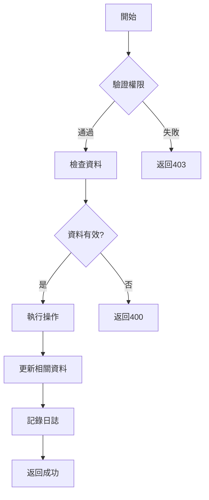

# 複雜 API 額外區塊

複雜 API 在簡單 API 範本的「4. 實作說明」中額外加入以下內容：

---

## 4. 實作說明

### 4.1 業務邏輯流程



### 4.2 詳細業務邏輯

#### 步驟1: [步驟名稱]
- 具體邏輯描述

#### 步驟2: [步驟名稱]
- 具體邏輯描述

#### 步驟3: [步驟名稱]
- 具體邏輯描述

### 4.3 SQL 查詢範例

```sql
-- 相關 SQL 查詢
```

### 4.4 併發處理

- 使用樂觀鎖防止併發更新衝突
- 更新時檢查 version 欄位或 updated_at

### 4.5 效能考量

- 批次處理資料更新
- 使用快取減少資料庫查詢
- 非同步處理耗時操作
